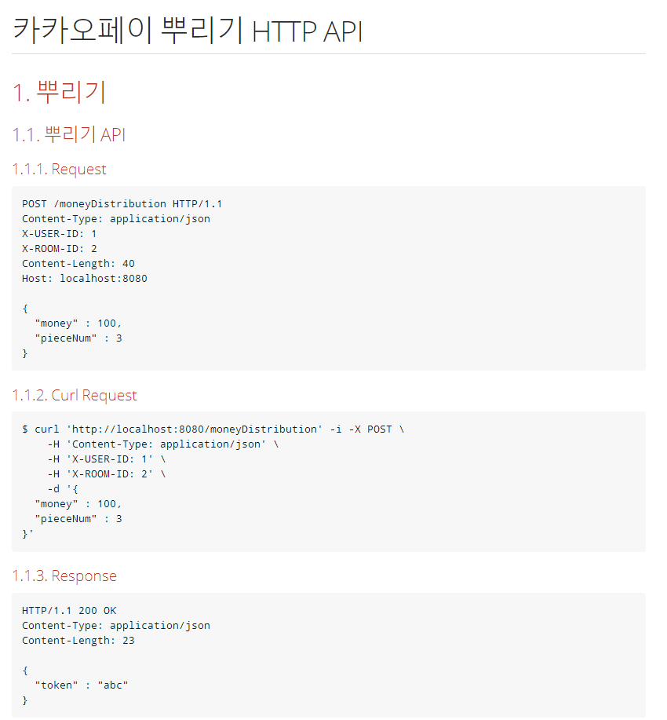

# 카카오페이 뿌리기 API

## Introduction

카카오페이에는 머니 뿌리기 기능이 있습니다.
- 사용자는 다수의 친구들이 있는 대화방에서 뿌릴 금액과 받아갈 대상의 숫자를
입력하여 뿌리기 요청을 보낼 수 있습니다.
- 요청 시 자신의 잔액이 감소되고 대화방에는 뿌리기 메세지가 발송됩니다.
- 대화방에 있는 다른 사용자들은 위에 발송된 메세지를 클릭하여 금액을 무작위로
받아가게 됩니다.

## 요구사항

- 뿌리기, 받기, 조회 기능을 수행하는 REST API 를 구현합니다.
    - 요청한 사용자의 식별값은 숫자 형태이며 "X-USER-ID" 라는 HTTP Header로
전달됩니다.
    - 요청한 사용자가 속한 대화방의 식별값은 문자 형태이며 "X-ROOM-ID" 라는
HTTP Header로 전달됩니다.
    - 모든 사용자는 뿌리기에 충분한 잔액을 보유하고 있다고 가정하여 별도로
잔액에 관련된 체크는 하지 않습니다.
- 작성하신 어플리케이션이 다수의 서버에 다수의 인스턴스로 동작하더라도 기능에
문제가 없도록 설계되어야 합니다.
- 각 기능 및 제약사항에 대한 단위테스트를 반드시 작성합니다

## 설계 방향

- Controller - Service - Domain의 3가지 Layer로 구성 
    - Controller: Http를 통해 client의 요청을 받고 필요한 경우 적절한 메세지를 반환한다.
    - Service: 뿌리기의 비지니스 로직을 담고 있다. Controller부터 요청을 받아 서비스를 제공한다.
    - Domain: 서비스의 주축이 되는 Enitity와 Enitity의 persistence를 담당하는 Repository가 위치한다.
- API에 대한 상세 문서를 작성한다
- 각 기능 및 제약사항에 대한 단위 테스트를 작성하며 테스트 커버리지를 측정하고 상세 문서화 한다.
- 뿌리기 시 생성되는 token은 고정 3자리 문자열이다. 
따라서, 제약없이 생성하게 되면 중복의 문제가 발생할 수 있기 때문에 최대 7일 조회 제약사항에 따라 
최근 7일동안 같은 채팅룸에서만 token이 중복되지 않는다는 제약을 추가한다. 즉, 7일이 지난 토큰은 중복되어 생성 가능하다.

## Entity 관계 설정

- 
    
## API 설계

- 요구 사항에 따라 뿌리기/받기/조회 3가지로 구성된다
- 상세 API
    - [API 문서](https://github.com/v0o0v/kakaopayMoneyDistribution/blob/master/api-guide.html)
    - 
    - 
    - 
   

## 테스트

- 테스트 결과
    - [테스트 커버리지 결과](https://github.com/v0o0v/kakaopayMoneyDistribution/blob/master/testCoverageAnalysis/index.html)
    - 
    
- Dependency Structure Matrix
    
    - 
        - DSM 결과 순환참조가 발생하지 않았으며 레이어 아키텍처가 적절하게 적용되었음
## 사용 기술
- Java 8
- Spring boot 2.3.1

## 빌드 방법
- mvn clean package

## 실행 방법
- mvn spring-boot:run 

    

    

